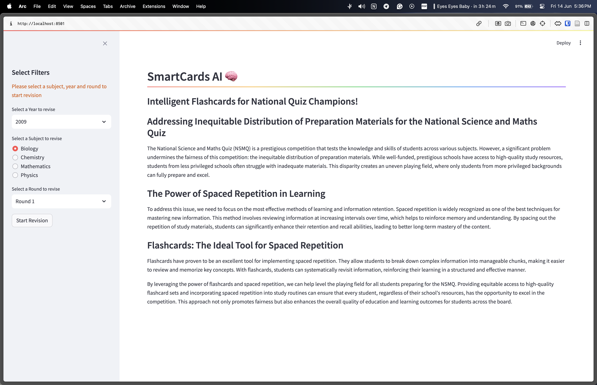
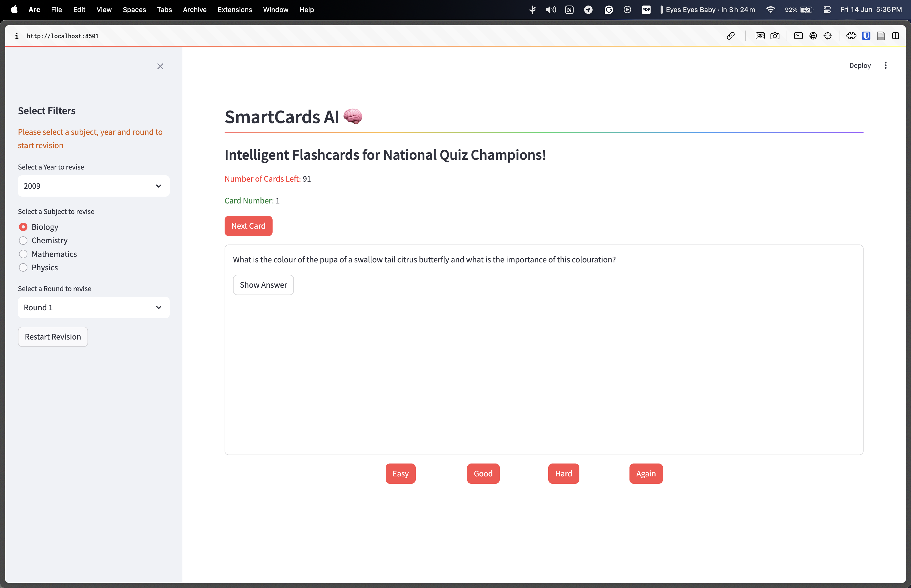
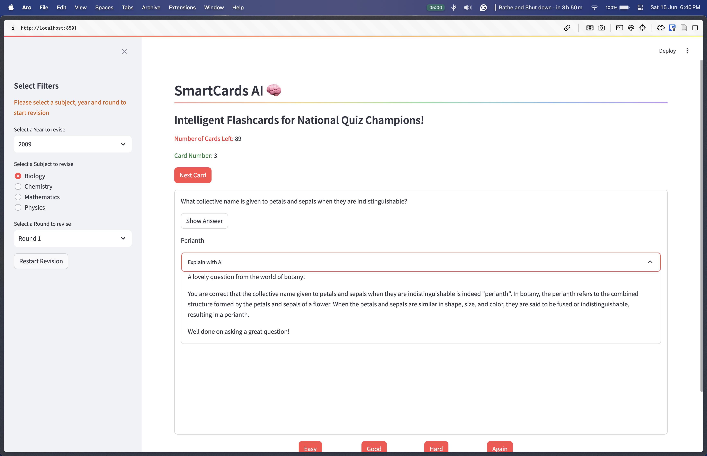

# SmartCards AI 🧠

## Intelligent Flashcards for National Quiz Champions

### Addressing Inequitable Distribution of Preparation Materials for the National Science and Maths Quiz

The National Science and Maths Quiz (NSMQ) is a prestigious competition that tests the knowledge and skills of students across various subjects. However, a significant problem undermines the fairness of this competition: the inequitable distribution of preparation materials. While well-funded, prestigious schools have access to high-quality study resources, students from less privileged schools often struggle with inadequate materials. This disparity creates an uneven playing field, where only students from more privileged backgrounds can fully prepare and excel.

### The Power of Spaced Repetition in Learning

To address this issue, we need to focus on the most effective methods of learning and information retention. Spaced repetition is widely recognized as one of the best techniques for mastering new information. This method involves reviewing information at increasing intervals over time, which helps to reinforce memory and understanding. By spacing out the repetition of study materials, students can significantly enhance their retention and recall abilities, leading to better long-term mastery of the content.

### Flashcards: The Ideal Tool for Spaced Repetition

Flashcards have proven to be an excellent tool for implementing spaced repetition. They allow students to break down complex information into manageable chunks, making it easier to review and memorize key concepts. With flashcards, students can systematically revisit information, reinforcing their learning in a structured and effective manner.

By leveraging the power of flashcards and spaced repetition, we can help level the playing field for all students preparing for the NSMQ. Providing equitable access to high-quality flashcard sets and incorporating spaced repetition into study routines can ensure that every student, regardless of their school's resources, has the opportunity to excel in the competition. This approach not only promotes fairness but also enhances the overall quality of education and learning outcomes for students across the board.

A major download of currently available flashcard apps are they give the answers without context which makes understand the concepts difficult. Smartcards AI uses Artificial Intelligence to explain the questions and answers in real time to facilitate understanding and prevent rote memorization.

## Getting Started

### Pre-requisits

- Python 3
- Pip
- Modern web browser

### Virtual Environment

#### Setting Up and Starting a Virtual Environment

To ensure a clean and isolated environment for your Python projects, it is recommended to use a virtual environment. Follow the steps below to set up and start a virtual environment:

1. **Install `virtualenv` (if not already installed)**:

    ```bash
    pip install virtualenv
    ```

2. **Create a new virtual environment**:

    Navigate to your project directory and run:

    ```bash
    virtualenv venv
    ```

    This command creates a directory named `venv` containing a new virtual environment.

3. **Activate the virtual environment**:
    - On **Windows**:

      ```bash
      venv\Scripts\activate
      ```

    - On **macOS and Linux**:

      ```bash
      source venv/bin/activate
      ```

4. **Install project dependencies**:

    Once the virtual environment is activated, install the project dependencies using:

    ```bash
    pip install -r requirements.txt
    ```

5. **Deactivate the virtual environment**:
    When you are done working on your project, deactivate the virtual environment by running:

    ```bash
    deactivate
    ```

### Running the Streamlit App

1. **Run the streamlit app**:

    ```bash
    streamlit run app/main.py
    ```

2. **Access the app**:
    After running the above command, Streamlit will start a local web server. Open your web browser and go to:

    ```bash
    http://localhost:8501
    ```

    to view and interact with the app

## Homepage

1. Once on the home page, select a year, topic and round you would want to practive
2. Click Start Revision to get started learning your selected questions



## Learning Page

1. Select how easy or difficult the answer to the specific question was to recall
2. Click next card to proceed to the next question
3. Use AI to explain answers you dont understand to aid your understanding and prevent memorization





## Spaced Repetition for Flashcards

Spaced repetition is a highly effective technique for enhancing memory retention. It involves reviewing information at increasing intervals over time, which helps to consolidate knowledge and improve recall. Here's how spaced repetition is used to determine when to show you the next flashcard:

## How Spaced Repetition Works

1. **Initial Review**:
    - When you first learn a new piece of information (a flashcard), you review it immediately. This helps to establish the initial memory.

2. **First Interval**:
    - After the initial review, the flashcard is shown again after a short interval, typically a few minutes or hours. This reinforces the memory while it is still fresh.

3. **Subsequent Intervals**:
    - As you continue to recall the information correctly, the intervals between reviews increase. This might mean reviewing the flashcard after a day, then a few days, a week, and so on.
    - If you struggle to recall the information, the interval is shortened, and the flashcard is shown more frequently until the information is more firmly embedded in your memory.

## Determining the Next Review

The timing of the next review for a flashcard is determined by algorithms that adjust based on your performance. Here's a general overview of the process:

1. **Ease Factor**:
    - Each flashcard has an "ease factor" that indicates how easily you can recall the information. The ease factor increases if you recall the information correctly and decreases if you struggle.

2. **Review Scheduling**:
    - The next review date is calculated based on the ease factor and the time since the last review. The formula typically involves multiplying the interval by the ease factor to determine the new interval.

3. **Performance Feedback**:
    - After each review, you provide feedback on how easy or difficult it was to recall the information. This feedback adjusts the ease factor and influences the scheduling of future reviews.

### Example of Spaced Repetition Intervals

1. **Initial Review**: Day 1
2. **First Review**: Day 2 (1 day later)
3. **Second Review**: Day 4 (2 days later)
4. **Third Review**: Day 8 (4 days later)
5. **Fourth Review**: Day 15 (7 days later)

If at any point you fail to recall the information, the interval is shortened, and the review frequency increases until you can reliably recall the information.

By using spaced repetition, you ensure that you review flashcards just before you are likely to forget them, optimizing your study time and enhancing long-term retention.
